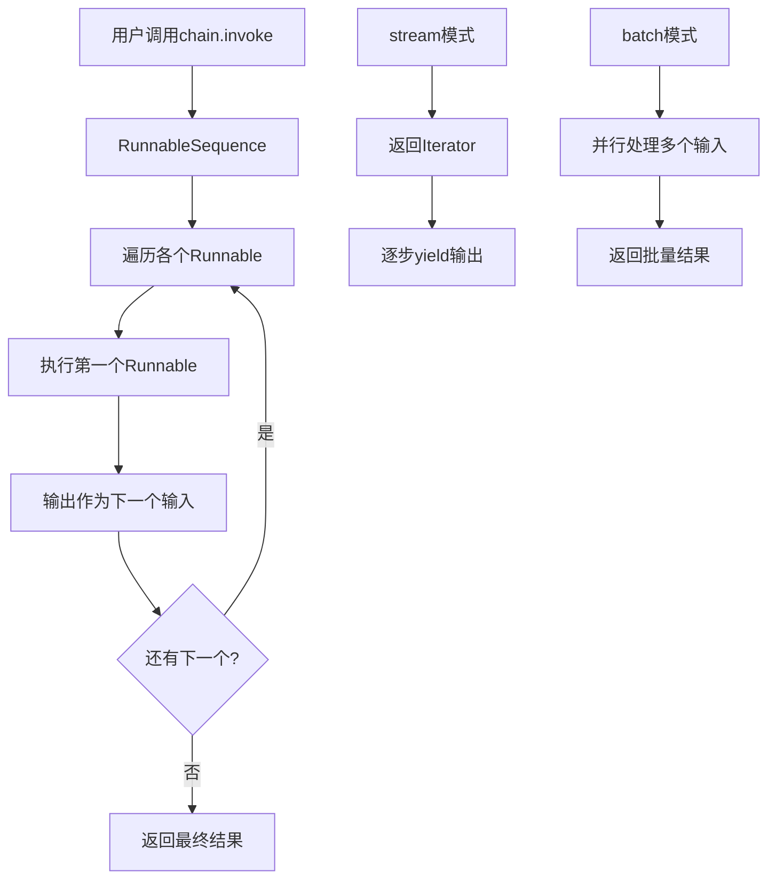
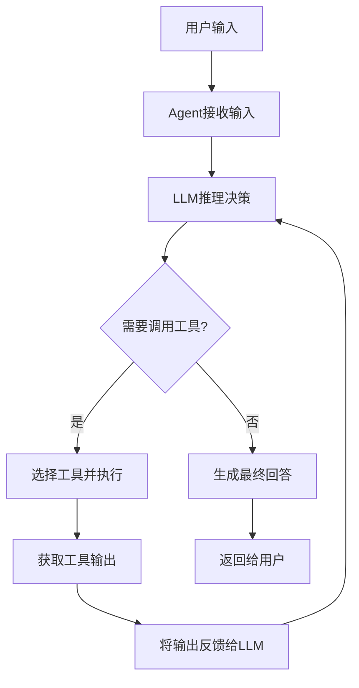
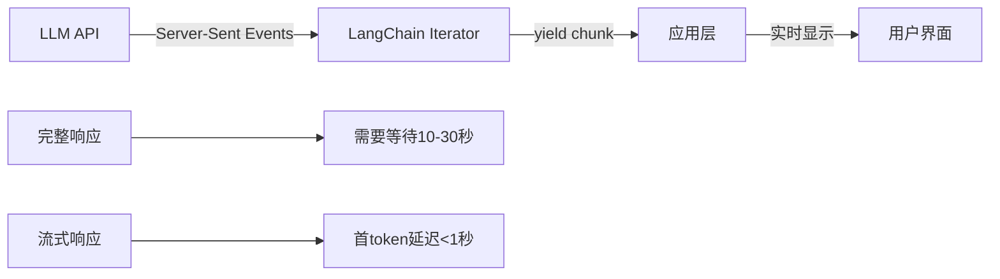
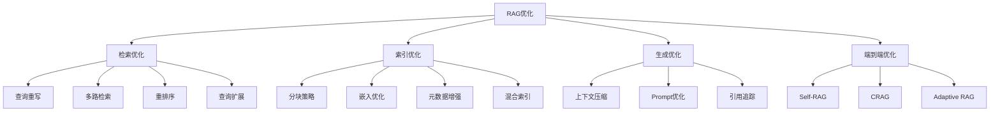
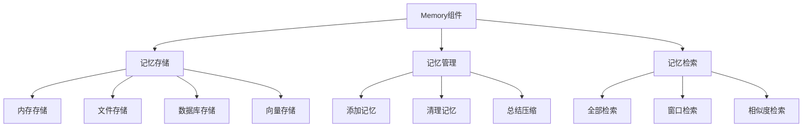
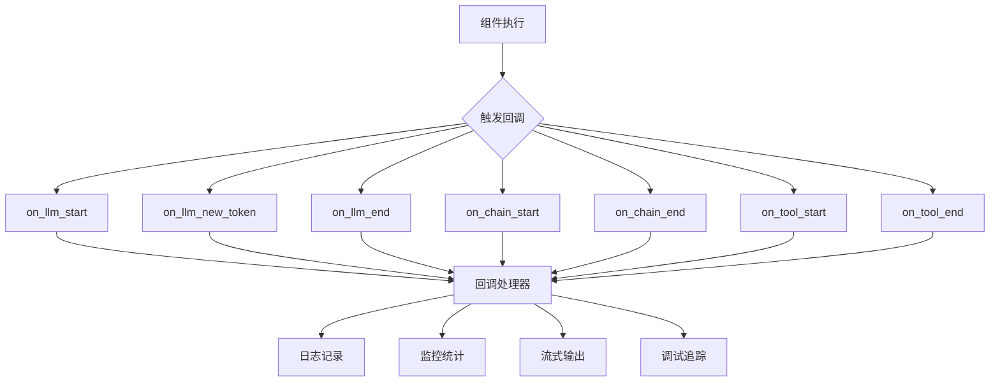
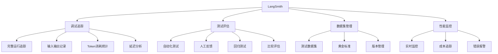
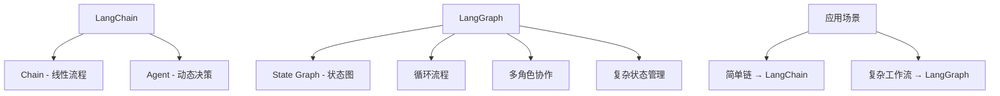

# LangChain 进阶问题

## Q1: LangChain中LCEL（LangChain Expression Language）的原理是什么？

**问题**：请深入解释LCEL的设计原理和内部实现机制。

**答案**：

LCEL（LangChain Expression Language）是LangChain引入的一种声明式语言，用于组合组件。它基于Unix管道思想，使用`|`操作符连接各个组件，形成可执行的链。

**设计原理**：

**1. Runnable协议**
LCEL的核心是Runnable协议，所有组件都实现这个协议，定义了统一的接口：

```python
class Runnable(Protocol):
    def invoke(self, input: Input) -> Output: ...
    def batch(self, inputs: list[Input]) -> list[Output]: ...
    def stream(self, input: Input) -> Iterator[Output]: ...
    def transform(self, input: Iterator[Input]) -> Iterator[Output]: ...
```

**2. 管道组合**
`|`操作符重载，将前一个组件的输出作为后一个组件的输入：

```python
def __or__(self, other: Runnable) -> RunnableSequence:
    return RunnableSequence(first=self, second=other)
```

**3. 自动类型推断**
LCEL会自动推断输入输出类型，确保组件之间的兼容性。

**内部实现流程**：



**优势分析**：

```python
from langchain_openai import ChatOpenAI
from langchain_core.prompts import ChatPromptTemplate
from langchain_core.output_parsers import StrOutputParser

prompt = ChatPromptTemplate.from_template("讲一个关于{topic}的笑话")
model = ChatOpenAI(model="gpt-4")
parser = StrOutputParser()

chain = prompt | model | parser

# LCEL自动提供三种调用方式
result = chain.invoke({"topic": "程序员"})      # 同步调用
results = chain.batch([{"topic": "程序员"}, {"topic": "医生"}])  # 批量调用
for chunk in chain.stream({"topic": "程序员"}):  # 流式输出
    print(chunk, end="", flush=True)

# 还支持异步调用
async def main():
    result = await chain.ainvoke({"topic": "程序员"})
    async for chunk in chain.astream({"topic": "程序员"}):
        print(chunk)
```

**高级特性**：

**1. RunnableParallel - 并行执行**
```python
from langchain_core.runnables import RunnableParallel

chain = RunnableParallel(
    joke=prompt | model | parser,
    poem=prompt2 | model | parser
)
```

**2. RunnablePassthrough - 数据传递**
```python
from langchain_core.runnables import RunnablePassthrough

chain = {
    "original": RunnablePassthrough(),
    "processed": prompt | model | parser
}
```

**3. RunnableLambda - 自定义函数**
```python
from langchain_core.runnables import RunnableLambda

def parse_length(text: str) -> int:
    return len(text)

chain = prompt | model | parser | RunnableLambda(parse_length)
```

**要点总结**：
- LCEL基于Runnable协议实现统一接口
- 管道操作符实现组件链式组合
- 自动支持invoke、batch、stream三种模式
- 提供RunnableParallel等高级组合原语

---

## Q2: LangChain Agent的工作原理是什么？如何实现工具调用？

**问题**：请深入解释Agent的工作原理和工具调用机制。

**答案**：

Agent是LangChain中最高级的抽象，它使用LLM作为推理引擎，动态决定执行路径和工具调用。

**工作原理**：



**核心组件**：

**1. Agent类型**
- **ReAct Agent**：推理+行动模式，逐步思考和执行
- **OpenAI Tools Agent**：利用OpenAI原生工具调用能力
- **Structured Chat Agent**：支持多输入参数的工具调用
- **Self-Ask with Search**：自问自答搜索模式

**2. Tools（工具）**
工具是Agent可以调用的函数，需要定义名称、描述和参数schema：

```python
from langchain_core.tools import tool
from pydantic import BaseModel, Field

class CalculatorInput(BaseModel):
    a: int = Field(description="第一个数字")
    b: int = Field(description="第二个数字")

@tool("calculator", args_schema=CalculatorInput)
def calculator(a: int, b: int) -> int:
    """计算两个数字的和"""
    return a + b
```

**3. AgentExecutor**
负责管理Agent的执行循环，处理工具调用和错误重试：

```python
from langchain_openai import ChatOpenAI
from langchain.agents import create_tool_calling_agent, AgentExecutor
from langchain_core.prompts import ChatPromptTemplate
from langchain_core.tools import tool

@tool
def search(query: str) -> str:
    """搜索网络信息"""
    return f"搜索结果：{query}"

@tool
def calculator(expression: str) -> str:
    """计算数学表达式"""
    try:
        return str(eval(expression))
    except:
        return "计算错误"

tools = [search, calculator]
llm = ChatOpenAI(model="gpt-4")

prompt = ChatPromptTemplate.from_messages([
    ("system", "你是一个有帮助的助手，可以使用工具。"),
    ("human", "{input}"),
    ("placeholder", "{agent_scratchpad}")
])

agent = create_tool_calling_agent(llm, tools, prompt)
agent_executor = AgentExecutor(agent=agent, tools=tools, verbose=True)

result = agent_executor.invoke({
    "input": "搜索Python的最新版本，然后告诉我2+2等于多少"
})
```

**工具调用机制详解**：

**1. 工具绑定（Tool Binding）**
LLM通过Function Calling能力识别需要调用的工具：

```python
# OpenAI工具调用格式
{
    "role": "assistant",
    "content": null,
    "tool_calls": [
        {
            "id": "call_123",
            "type": "function",
            "function": {
                "name": "search",
                "arguments": "{\"query\": \"Python最新版本\"}"
            }
        }
    ]
}
```

**2. 执行循环**
AgentExecutor的核心执行逻辑：

```python
while not finished:
    # 1. 调用LLM获取下一步行动
    response = agent.llm.invoke(messages)
    
    # 2. 检查是否需要调用工具
    if response.tool_calls:
        for tool_call in response.tool_calls:
            # 3. 执行工具
            tool_output = execute_tool(tool_call)
            # 4. 将结果加入消息历史
            messages.append(tool_output)
    else:
        # 5. 没有工具调用，返回最终答案
        return response.content
```

**ReAct推理模式**：

ReAct（Reasoning + Acting）是Agent常用的推理模式：

```
Thought: 用户想了解Python最新版本
Action: search
Action Input: Python最新版本
Observation: Python 3.12是最新的稳定版本
Thought: 我找到了Python的最新版本信息
Final Answer: Python的最新稳定版本是3.12
```

**要点总结**：
- Agent使用LLM作为推理引擎动态决策
- 工具通过@tool装饰器定义
- AgentExecutor管理执行循环和错误处理
- ReAct模式实现推理与行动结合

---

## Q3: LangChain如何实现流式输出？内部机制是什么？

**问题**：请解释LangChain流式输出的实现原理和使用方式。

**答案**：

流式输出（Streaming）允许LLM逐token返回结果，而不是等待完整响应，大幅提升用户体验。

**实现原理**：



**核心机制**：

**1. Server-Sent Events (SSE)**
大多数LLM API使用SSE协议实现流式传输，LangChain将其封装为Python Iterator：

```python
import httpx

async def stream_llm_response():
    async with httpx.AsyncClient() as client:
        async with client.stream("POST", url, json=data) as response:
            async for line in response.aiter_lines():
                if line.startswith("data: "):
                    yield parse_chunk(line)
```

**2. Runnable协议的stream方法**
所有LCEL组件都实现stream方法：

```python
from langchain_openai import ChatOpenAI
from langchain_core.prompts import ChatPromptTemplate
from langchain_core.output_parsers import StrOutputParser

prompt = ChatPromptTemplate.from_template("写一首关于{topic}的诗")
model = ChatOpenAI(model="gpt-4", streaming=True)
parser = StrOutputParser()

chain = prompt | model | parser

# 同步流式
for chunk in chain.stream({"topic": "春天"}):
    print(chunk, end="", flush=True)

# 异步流式
async def async_stream():
    async for chunk in chain.astream({"topic": "春天"}):
        print(chunk, end="", flush=True)
```

**流式处理的关键组件**：

**1. LLM层流式**
```python
# ChatOpenAI内部实现
async def astream(self, messages):
    async for chunk in self.client.chat.completions.create(
        model=self.model,
        messages=messages,
        stream=True
    ):
        if chunk.choices[0].delta.content:
            yield chunk.choices[0].delta.content
```

**2. Output Parser流式传递**
Parser需要处理增量输出：

```python
class StrOutputParser(Runnable):
    def stream(self, input):
        # 对于字符串解析器，直接透传
        yield from input
```

**3. 链式流式处理**
LCEL自动处理链式流式：

```python
# prompt | model | parser 的流式流程
def stream(self, input):
    # 1. prompt处理（立即完成）
    prompt_output = self.prompt.invoke(input)
    
    # 2. model流式输出
    for chunk in self.model.stream(prompt_output):
        # 3. parser逐块处理
        parser_chunk = self.parser.transform([chunk])
        yield from parser_chunk
```

**高级流式模式**：

**1. 回调处理器（Callback Handler）**
```python
from langchain_core.callbacks import BaseCallbackHandler

class StreamingHandler(BaseCallbackHandler):
    def on_llm_new_token(self, token: str, **kwargs):
        print(token, end="", flush=True)

model = ChatOpenAI(
    model="gpt-4",
    streaming=True,
    callbacks=[StreamingHandler()]
)
```

**2. 异步生成器**
```python
async def generate_stream(topic: str):
    async for chunk in chain.astream({"topic": topic}):
        yield f"data: {chunk}\n\n"
```

**3. 带中间步骤的流式**
```python
from langchain_core.runnables import RunnablePassthrough

chain = {
    "topic": RunnablePassthrough(),
    "result": prompt | model | parser
}

async for chunk in chain.astream("春天"):
    if "result" in chunk:
        print(chunk["result"], end="")
```

**要点总结**：
- 流式输出基于SSE协议和Python Iterator
- Runnable协议统一stream接口
- LCEL自动处理链式流式传递
- 支持回调和异步生成器模式

---

## Q4: LangChain的RAG优化策略有哪些？

**问题**：请介绍LangChain中RAG系统的优化策略和最佳实践。

**答案**：

RAG系统的性能取决于检索质量和生成质量，LangChain提供了多种优化策略。

**RAG优化框架**：



**1. 检索优化策略**

**查询重写（Query Rewriting）**
```python
from langchain.retrievers import ContextualCompressionRetriever
from langchain.retrievers.document_compressors import LLMChainExtractor

# 使用LLM重写查询，使其更适合检索
llm = ChatOpenAI(model="gpt-4")

rewrite_prompt = ChatPromptTemplate.from_template("""
请将以下问题重写为更适合文档检索的形式：
原始问题：{query}
重写问题：
""")

rewrite_chain = rewrite_prompt | llm | StrOutputParser()
```

**多路检索（Multi-Query）**
```python
from langchain.retrievers.multi_query import MultiQueryRetriever

llm = ChatOpenAI(model="gpt-4")
base_retriever = vectorstore.as_retriever()

# 自动生成多个相关查询
retriever = MultiQueryRetriever.from_llm(
    retriever=base_retriever,
    llm=llm
)
```

**重排序（Re-ranking）**
```python
from langchain.retrievers import EnsembleRetriever
from langchain.retrievers.document_compressors import CrossEncoderReranker

# 混合检索器
bm25_retriever = BM25Retriever.from_documents(documents)
vector_retriever = vectorstore.as_retriever()

ensemble_retriever = EnsembleRetriever(
    retrievers=[bm25_retriever, vector_retriever],
    weights=[0.4, 0.6]
)

# 使用Cross-Encoder重排序
reranker = CrossEncoderReranker(top_n=5)
compression_retriever = ContextualCompressionRetriever(
    base_compressor=reranker,
    base_retriever=ensemble_retriever
)
```

**2. 索引优化策略**

**智能分块**
```python
from langchain_text_splitters import (
    RecursiveCharacterTextSplitter,
    MarkdownHeaderTextSplitter,
    SemanticChunker
)

# 递归分块（按段落、句子、字符递归）
recursive_splitter = RecursiveCharacterTextSplitter(
    chunk_size=1000,
    chunk_overlap=200,
    separators=["\n\n", "\n", ". ", " ", ""]
)

# 语义分块（基于句子相似度）
semantic_splitter = SemanticChunker(
    embeddings=OpenAIEmbeddings(),
    breakpoint_threshold_type="percentile"
)

# Markdown按标题分块
md_splitter = MarkdownHeaderTextSplitter(
    headers_to_split_on=[("#", "Header1"), ("##", "Header2")]
)
```

**元数据增强**
```python
from langchain_core.documents import Document

def enhance_documents(documents):
    enhanced = []
    for doc in documents:
        # 添加元数据
        doc.metadata["chunk_id"] = generate_id()
        doc.metadata["source"] = doc.metadata.get("source")
        doc.metadata["page"] = doc.metadata.get("page")
        
        # 添加摘要作为元数据
        doc.metadata["summary"] = generate_summary(doc.page_content)
        enhanced.append(doc)
    return enhanced
```

**3. 生成优化策略**

**上下文压缩**
```python
from langchain.retrievers.document_compressors import LLMChainFilter

# 使用LLM过滤无关文档
compressor = LLMChainFilter.from_llm(llm)
compression_retriever = ContextualCompressionRetriever(
    base_compressor=compressor,
    base_retriever=retriever
)
```

**引用追踪**
```python
from langchain.chains import RetrievalQAWithSourcesChain

qa_chain = RetrievalQAWithSourcesChain.from_chain_type(
    llm=llm,
    retriever=retriever,
    return_source_documents=True
)

result = qa_chain.invoke({"question": "什么是RAG？"})
print(result["answer"])
print(result["sources"])  # 引用来源
```

**4. 高级RAG架构**

**Self-RAG（自反思RAG）**
```python
# 检索反思：是否需要检索？
# 相关性反思：检索内容是否相关？
# 支持性反思：内容是否支持回答？
# 有用性反思：回答是否有用？
```

**CRAG（纠正性RAG）**
```python
# 评估检索文档质量
# 质量低 → 网络搜索补充
# 质量高 → 直接使用
# 模糊 → 细化查询重新检索
```

**要点总结**：
- 检索优化：查询重写、多路检索、重排序
- 索引优化：智能分块、元数据增强
- 生成优化：上下文压缩、引用追踪
- 高级架构：Self-RAG、CRAG、Adaptive RAG

---

## Q5: LangChain Memory的实现原理是什么？如何实现持久化？

**答案**：

Memory组件的核心是在多轮对话中维护和检索上下文状态，实现持久化需要将记忆存储到外部存储系统。

**Memory架构设计**：



**核心接口**：

```python
class BaseMemory(ABC):
    @abstractmethod
    def load_memory_variables(self, inputs: dict) -> dict:
        """加载记忆变量"""
        
    @abstractmethod
    def save_context(self, inputs: dict, outputs: dict) -> None:
        """保存对话上下文"""

class BaseChatMemory(BaseMemory):
    def __init__(self, chat_memory=None, return_messages=False):
        self.chat_memory = chat_memory or ChatMessageHistory()
        self.return_messages = return_messages
```

**实现原理详解**：

**1. ConversationBufferMemory**
直接存储所有对话消息：

```python
from langchain.memory import ConversationBufferMemory
from langchain_openai import ChatOpenAI
from langchain.chains import ConversationChain

memory = ConversationBufferMemory(return_messages=True)

conversation = ConversationChain(
    llm=ChatOpenAI(model="gpt-4"),
    memory=memory,
    verbose=True
)

conversation.invoke({"input": "你好"})
print(memory.load_memory_variables({}))
# {'history': [HumanMessage('你好'), AIMessage('你好！有什么我可以帮助你的吗？')]}
```

**2. ConversationBufferWindowMemory**
维护滑动窗口：

```python
from langchain.memory import ConversationBufferWindowMemory

memory = ConversationBufferWindowMemory(
    k=3,  # 只保留最近3轮对话
    return_messages=True
)

# 内部实现
def save_context(self, inputs, outputs):
    self.chat_memory.add_messages([inputs, outputs])
    # 截断超过k轮的消息
    if len(self.chat_memory.messages) > self.k * 2:
        self.chat_memory.messages = self.chat_memory.messages[-self.k * 2:]
```

**3. 持久化实现**

**文件存储**
```python
from langchain.memory import FileChatMessageHistory
import json
import os

class PersistentMemory:
    def __init__(self, session_id: str, storage_dir: str = "memory"):
        self.session_id = session_id
        self.storage_path = os.path.join(storage_dir, f"{session_id}.json")
        self.memory = self._load_or_create()
    
    def _load_or_create(self):
        if os.path.exists(self.storage_path):
            with open(self.storage_path, 'r') as f:
                data = json.load(f)
                memory = ConversationBufferMemory(return_messages=True)
                memory.chat_memory.messages = [
                    HumanMessage(m['content']) if m['type'] == 'human' 
                    else AIMessage(m['content'])
                    for m in data['messages']
                ]
                return memory
        return ConversationBufferMemory(return_messages=True)
    
    def save(self):
        with open(self.storage_path, 'w') as f:
            json.dump({
                'messages': [
                    {'type': 'human', 'content': m.content} 
                    if isinstance(m, HumanMessage) 
                    else {'type': 'ai', 'content': m.content}
                    for m in self.memory.chat_memory.messages
                ]
            }, f)
```

**Redis存储**
```python
import redis
import json
from langchain.schema import HumanMessage, AIMessage

class RedisMemory:
    def __init__(self, session_id: str, redis_url: str = "redis://localhost:6379"):
        self.session_id = session_id
        self.redis = redis.from_url(redis_url)
        self.key = f"memory:{session_id}"
    
    def save_context(self, inputs: dict, outputs: dict):
        messages = self._get_messages()
        messages.append({
            'role': 'human',
            'content': inputs['input']
        })
        messages.append({
            'role': 'ai',
            'content': outputs['output']
        })
        self.redis.set(self.key, json.dumps(messages))
    
    def load_memory_variables(self, inputs: dict) -> dict:
        messages = self._get_messages()
        return {
            'history': [
                HumanMessage(m['content']) if m['role'] == 'human'
                else AIMessage(m['content'])
                for m in messages
            ]
        }
    
    def _get_messages(self) -> list:
        data = self.redis.get(self.key)
        return json.loads(data) if data else []
```

**向量存储持久化**
```python
from langchain.memory import VectorStoreMemory
from langchain_community.vectorstores import Chroma

class PersistentVectorMemory:
    def __init__(self, session_id: str, persist_directory: str):
        self.vectorstore = Chroma(
            persist_directory=persist_directory,
            embedding_function=OpenAIEmbeddings()
        )
        self.session_id = session_id
    
    def save_context(self, inputs, outputs):
        text = f"User: {inputs['input']}\nAI: {outputs['output']}"
        self.vectorstore.add_texts(
            texts=[text],
            metadatas=[{'session_id': self.session_id}]
        )
    
    def load_memory_variables(self, inputs):
        query = inputs['input']
        docs = self.vectorstore.similarity_search(
            query, 
            k=5,
            filter={'session_id': self.session_id}
        )
        return {'history': '\n'.join([d.page_content for d in docs])}
```

**与LCEL集成**：

```python
from langchain_core.runnables import RunnablePassthrough

def get_memory_messages(session_id: str) -> list:
    memory = PersistentMemory(session_id)
    return memory.load_memory_variables({})['history']

chain = (
    RunnablePassthrough.assign(
        history=lambda x: get_memory_messages(x['session_id'])
    )
    | prompt
    | model
    | parser
)

# 使用后保存
response = chain.invoke({"input": "你好", "session_id": "user123"})
memory = PersistentMemory("user123")
memory.save_context(
    {"input": "你好"},
    {"output": response}
)
```

**要点总结**：
- Memory核心是load_memory_variables和save_context接口
- 持久化需要外部存储（文件、Redis、向量库）
- 选择Memory类型需平衡完整性和token限制
- 向量存储Memory支持语义检索相关记忆

---

## Q6: LangChain的回调系统（Callbacks）是如何工作的？

**问题**：请解释LangChain回调系统的工作原理和应用场景。

**答案**：

回调系统是LangChain的观测性基础，允许在组件生命周期的关键节点执行自定义逻辑，用于日志记录、性能监控、流式输出等场景。

**回调架构**：



**核心接口**：

```python
from langchain_core.callbacks import BaseCallbackHandler
from typing import Any, Dict, List

class BaseCallbackHandler:
    # LLM回调
    def on_llm_start(self, serialized, prompts, **kwargs): pass
    def on_llm_new_token(self, token, **kwargs): pass
    def on_llm_end(self, response, **kwargs): pass
    def on_llm_error(self, error, **kwargs): pass
    
    # Chain回调
    def on_chain_start(self, serialized, inputs, **kwargs): pass
    def on_chain_end(self, outputs, **kwargs): pass
    def on_chain_error(self, error, **kwargs): pass
    
    # Tool回调
    def on_tool_start(self, serialized, input_str, **kwargs): pass
    def on_tool_end(self, output, **kwargs): pass
    
    # Agent回调
    def on_agent_action(self, action, **kwargs): pass
    def on_agent_finish(self, finish, **kwargs): pass
    
    # Retrieval回调
    def on_retriever_start(self, serialized, query, **kwargs): pass
    def on_retriever_end(self, documents, **kwargs): pass
```

**实现自定义回调**：

```python
from langchain_core.callbacks import BaseCallbackHandler
from langchain_openai import ChatOpenAI
from langchain_core.prompts import ChatPromptTemplate

class MyCallbackHandler(BaseCallbackHandler):
    def __init__(self):
        self.token_count = 0
        self.start_time = None
    
    def on_llm_start(self, serialized, prompts, **kwargs):
        import time
        self.start_time = time.time()
        print(f"[LLM开始] 提示词: {prompts[0][:50]}...")
    
    def on_llm_new_token(self, token, **kwargs):
        self.token_count += 1
        print(token, end="", flush=True)
    
    def on_llm_end(self, response, **kwargs):
        import time
        elapsed = time.time() - self.start_time
        print(f"\n[LLM结束] 生成{self.token_count}个token, 耗时{elapsed:.2f}秒")
    
    def on_chain_start(self, serialized, inputs, **kwargs):
        print(f"[Chain开始] 输入: {inputs}")
    
    def on_chain_end(self, outputs, **kwargs):
        print(f"[Chain结束] 输出: {outputs}")

# 使用回调
handler = MyCallbackHandler()
llm = ChatOpenAI(model="gpt-4", callbacks=[handler], streaming=True)
prompt = ChatPromptTemplate.from_template("讲一个关于{topic}的故事")
chain = prompt | llm

chain.invoke({"topic": "程序员"}, config={"callbacks": [handler]})
```

**应用场景**：

**1. 流式输出处理**
```python
class StreamingHandler(BaseCallbackHandler):
    def __init__(self, queue):
        self.queue = queue
    
    def on_llm_new_token(self, token, **kwargs):
        self.queue.put(token)
    
    def on_llm_end(self, response, **kwargs):
        self.queue.put(None)  # 结束信号
```

**2. 性能监控**
```python
import time
from collections import defaultdict

class PerformanceMonitor(BaseCallbackHandler):
    def __init__(self):
        self.metrics = defaultdict(list)
        self.start_times = {}
    
    def on_llm_start(self, serialized, prompts, run_id, **kwargs):
        self.start_times[run_id] = time.time()
    
    def on_llm_end(self, response, run_id, **kwargs):
        elapsed = time.time() - self.start_times[run_id]
        self.metrics['llm_latency'].append(elapsed)
        self.metrics['token_count'].append(response.llm_output.get('token_usage'))
    
    def get_stats(self):
        return {
            'avg_latency': sum(self.metrics['llm_latency']) / len(self.metrics['llm_latency']),
            'total_tokens': sum(m['total_tokens'] for m in self.metrics['token_count'])
        }
```

**3. 调试追踪**
```python
class DebugHandler(BaseCallbackHandler):
    def __init__(self, verbose=True):
        self.verbose = verbose
        self.indent = 0
    
    def _print(self, text):
        print("  " * self.indent + text)
    
    def on_chain_start(self, serialized, inputs, **kwargs):
        self._print(f"→ Chain: {serialized.get('name', 'unknown')}")
        self.indent += 1
    
    def on_chain_end(self, outputs, **kwargs):
        self.indent -= 1
        self._print(f"← Chain结束")
    
    def on_tool_start(self, serialized, input_str, **kwargs):
        self._print(f"→ Tool: {serialized.get('name')}")
        self._print(f"  输入: {input_str}")
        self.indent += 1
    
    def on_tool_end(self, output, **kwargs):
        self.indent -= 1
        self._print(f"← Tool输出: {output[:100]}")
```

**4. 日志记录**
```python
import logging
from datetime import datetime

class LoggingHandler(BaseCallbackHandler):
    def __init__(self, log_file="langchain.log"):
        self.logger = logging.getLogger("LangChain")
        handler = logging.FileHandler(log_file)
        handler.setFormatter(logging.Formatter('%(asctime)s - %(message)s'))
        self.logger.addHandler(handler)
        self.logger.setLevel(logging.INFO)
    
    def on_llm_start(self, serialized, prompts, **kwargs):
        self.logger.info(f"LLM_START: {len(prompts)} prompts")
    
    def on_llm_end(self, response, **kwargs):
        self.logger.info(f"LLM_END: tokens={response.llm_output}")
    
    def on_tool_start(self, serialized, input_str, **kwargs):
        self.logger.info(f"TOOL_START: {serialized.get('name')}")
    
    def on_tool_end(self, output, **kwargs):
        self.logger.info(f"TOOL_END: {output[:100]}")
```

**回调配置方式**：

```python
# 1. 构造函数传入
llm = ChatOpenAI(callbacks=[handler])

# 2. invoke时传入
chain.invoke({"input": "hello"}, config={"callbacks": [handler]})

# 3. 全局设置
from langchain_core.callbacks import set_handler
set_handler(handler)
```

**要点总结**：
- 回调系统在组件生命周期的关键节点触发
- BaseCallbackHandler定义所有可用回调方法
- 主要应用：流式输出、监控统计、调试追踪
- 可通过构造函数、invoke参数或全局方式配置

---

## Q7: LangChain如何与LangSmith集成进行调试和评估？

**问题**：请介绍LangSmith的功能和与LangChain的集成方式。

**答案**：

LangSmith是LangChain官方提供的观测和评估平台，用于调试、测试、评估和监控LLM应用。

**LangSmith核心功能**：



**集成配置**：

```python
import os

# 设置环境变量
os.environ["LANGCHAIN_TRACING_V2"] = "true"
os.environ["LANGCHAIN_API_KEY"] = "your-api-key"
os.environ["LANGCHAIN_PROJECT"] = "my-project"  # 项目名称

# 之后的LangChain代码会自动追踪
from langchain_openai import ChatOpenAI
from langchain_core.prompts import ChatPromptTemplate

llm = ChatOpenAI(model="gpt-4")
prompt = ChatPromptTemplate.from_template("翻译以下文本为英文：{text}")
chain = prompt | llm

# 自动追踪到LangSmith
chain.invoke({"text": "你好世界"})
```

**运行追踪详情**：

```python
# LangSmith会记录完整的运行链路
{
  "id": "run_abc123",
  "name": "RunnableSequence",
  "run_type": "chain",
  "inputs": {"text": "你好世界"},
  "outputs": {"text": "Hello World"},
  "start_time": "2024-01-01T10:00:00",
  "end_time": "2024-01-01T10:00:02",
  "latency": 2.5,
  "token_usage": {
    "prompt_tokens": 10,
    "completion_tokens": 5,
    "total_tokens": 15
  },
  "children": [
    {
      "name": "ChatPromptTemplate",
      "run_type": "prompt",
      ...
    },
    {
      "name": "ChatOpenAI",
      "run_type": "llm",
      ...
    }
  ]
}
```

**创建测试数据集**：

```python
from langsmith import Client

client = Client()

# 创建数据集
dataset = client.create_dataset(
    name="translation_test",
    description="翻译测试数据集"
)

# 添加测试样本
examples = [
    {"input": "你好", "expected": "Hello"},
    {"input": "谢谢", "expected": "Thank you"},
    {"input": "再见", "expected": "Goodbye"}
]

for example in examples:
    client.create_example(
        inputs={"text": example["input"]},
        outputs={"translation": example["expected"]},
        dataset_id=dataset.id
    )
```

**评估器（Evaluator）**：

```python
from langchain.evaluation import load_evaluator
from langsmith import Client

# 创建评估器
exact_match = load_evaluator("exact_match")
embedding_distance = load_evaluator("embedding_distance")
llm_evaluator = load_evaluator(
    "criteria",
    criteria="conciseness",
    llm=ChatOpenAI(model="gpt-4")
)

# 运行评估
def evaluate_translation(run, example):
    prediction = run.outputs.get("text", "")
    reference = example.outputs.get("translation", "")
    
    # 精确匹配
    exact_score = exact_match.evaluate_strings(
        prediction=prediction,
        reference=reference
    )
    
    # 语义相似度
    embedding_score = embedding_distance.evaluate_strings(
        prediction=prediction,
        reference=reference
    )
    
    return {
        "exact_match": exact_score["score"],
        "embedding_similarity": embedding_score["score"]
    }

# 使用LangSmith运行测试
client.run_on_dataset(
    dataset_name="translation_test",
    llm_or_chain_factory=lambda: chain,
    evaluation=evaluate_translation
)
```

**自定义评估器**：

```python
from langchain.evaluation import StringEvaluator

class TranslationEvaluator(StringEvaluator):
    @property
    def requires_input(self):
        return True
    
    @property
    def requires_reference(self):
        return True
    
    def _evaluate_strings(self, prediction, reference, input=None, **kwargs):
        # 自定义评估逻辑
        score = custom_scoring_function(prediction, reference)
        return {
            "score": score,
            "reasoning": f"Translation quality score: {score}"
        }

# 使用自定义评估器
client.run_on_dataset(
    dataset_name="translation_test",
    llm_or_chain_factory=lambda: chain,
    evaluation=[TranslationEvaluator()]
)
```

**性能监控与反馈**：

```python
from langsmith import Client

client = Client()

# 获取项目运行统计
runs = client.list_runs(
    project_name="my-project",
    execution_order=1  # 只获取顶层运行
)

# 分析性能
for run in runs:
    print(f"Run ID: {run.id}")
    print(f"Latency: {run.total_tokens}")
    print(f"Status: {run.status}")
    
# 添加人工反馈
client.create_feedback(
    run_id="run_abc123",
    key="correctness",
    score=1.0,  # 0-1
    comment="翻译准确"
)
```

**集成LangSmith的最佳实践**：

```python
import os
from langchain_openai import ChatOpenAI
from langchain_core.prompts import ChatPromptTemplate
from langsmith import Client

# 1. 生产环境配置
os.environ["LANGCHAIN_TRACING_V2"] = "true"
os.environ["LANGCHAIN_PROJECT"] = os.getenv("ENVIRONMENT", "development")

# 2. 标记运行元数据
chain = prompt | llm
chain.invoke(
    {"text": "hello"},
    config={
        "tags": ["production", "v1.0"],
        "metadata": {
            "user_id": "user123",
            "session_id": "session456"
        }
    }
)

# 3. 错误追踪
try:
    chain.invoke({"text": input})
except Exception as e:
    client.create_feedback(
        run_id=current_run_id,
        key="error",
        score=0,
        comment=str(e)
    )
```

**要点总结**：
- LangSmith提供调试、测试、评估、监控四大功能
- 通过环境变量一键集成，自动追踪运行
- 支持创建测试数据集和自定义评估器
- 提供人工反馈和性能统计分析能力

---

## Q8: LangChain与LangGraph的关系是什么？LangGraph解决了什么问题？

**问题**：请解释LangGraph与LangChain的关系，以及LangGraph解决的问题。

**答案**：

LangGraph是LangChain生态系统的一部分，专注于构建有状态、多角色的复杂LLM应用。它扩展了Chain的概念，支持循环和条件分支。

**LangChain vs LangGraph**：



**LangGraph解决的问题**：

**1. 循环和条件分支**
Chain是DAG（有向无环图），不支持循环。LangGraph支持任意流程拓扑：

```python
# LangChain的线性链
chain = prompt1 | model1 | prompt2 | model2

# LangGraph的循环图
from langgraph.graph import StateGraph, END

def should_continue(state):
    if state["iterations"] >= 5:
        return "end"
    return "continue"

workflow = StateGraph(AgentState)
workflow.add_node("agent", agent_node)
workflow.add_node("tools", tool_node)
workflow.add_edge("agent", "tools")
workflow.add_conditional_edges(
    "tools",
    should_continue,
    {"continue": "agent", "end": END}
)
```

**2. 复杂状态管理**
LangGraph提供明确的状态管理：

```python
from typing import TypedDict, Annotated
from langgraph.graph import StateGraph

class AgentState(TypedDict):
    messages: list
    iterations: int
    next_action: str

# 状态会自动传递给每个节点
def agent_node(state: AgentState) -> AgentState:
    # 处理逻辑
    state["iterations"] += 1
    return state

def tool_node(state: AgentState) -> AgentState:
    # 执行工具
    result = execute_tool(state["next_action"])
    state["messages"].append(result)
    return state

workflow = StateGraph(AgentState)
workflow.add_node("agent", agent_node)
workflow.add_node("tools", tool_node)
```

**3. 多角色协作**
支持多个Agent协作完成复杂任务：

```python
from langgraph.graph import StateGraph

class ResearchState(TypedDict):
    query: str
    research_data: list
    draft: str
    review_comments: list

def researcher(state: ResearchState) -> ResearchState:
    # 搜索和收集信息
    data = search_web(state["query"])
    state["research_data"].extend(data)
    return state

def writer(state: ResearchState) -> ResearchState:
    # 撰写初稿
    draft = write_article(state["research_data"])
    state["draft"] = draft
    return state

def reviewer(state: ResearchState) -> ResearchState:
    # 审核并提供修改建议
    comments = review_draft(state["draft"])
    state["review_comments"] = comments
    return state

def should_revise(state: ResearchState) -> str:
    if len(state["review_comments"]) > 0:
        return "revise"
    return "publish"

workflow = StateGraph(ResearchState)
workflow.add_node("researcher", researcher)
workflow.add_node("writer", writer)
workflow.add_node("reviewer", reviewer)

workflow.set_entry_point("researcher")
workflow.add_edge("researcher", "writer")
workflow.add_edge("writer", "reviewer")
workflow.add_conditional_edges(
    "reviewer",
    should_revise,
    {"revise": "writer", "publish": END}
)
```

**4. 持久化和恢复**
支持状态持久化，可以暂停和恢复执行：

```python
from langgraph.checkpoint.sqlite import SqliteSaver

# 使用SQLite持久化状态
memory = SqliteSaver.from_conn_string("checkpoints.db")

app = workflow.compile(checkpointer=memory)

# 执行并保存状态
config = {"configurable": {"thread_id": "conversation-123"}}
result = app.invoke({"input": "hello"}, config)

# 恢复执行
result = app.invoke(None, config)  # 使用相同thread_id恢复
```

**LangGraph核心概念**：

```python
from langgraph.graph import StateGraph, END
from typing import TypedDict

# 1. 定义状态
class State(TypedDict):
    messages: list
    count: int

# 2. 定义节点函数
def node_a(state: State) -> State:
    state["count"] += 1
    return state

def node_b(state: State) -> State:
    state["messages"].append("processed")
    return state

# 3. 构建图
graph = StateGraph(State)
graph.add_node("a", node_a)
graph.add_node("b", node_b)

# 4. 添加边
graph.set_entry_point("a")
graph.add_edge("a", "b")
graph.add_edge("b", END)

# 5. 编译并运行
app = graph.compile()
result = app.invoke({"messages": [], "count": 0})
```

**实际应用示例 - 自主Agent**：

```python
from langgraph.graph import StateGraph, END
from langgraph.prebuilt import ToolExecutor
from langchain_openai import ChatOpenAI
from langchain_core.tools import tool

@tool
def search(query: str) -> str:
    """搜索网络"""
    return f"搜索结果: {query}"

@tool
def calculator(expression: str) -> str:
    """计算"""
    return str(eval(expression))

tools = [search, calculator]
tool_executor = ToolExecutor(tools)
llm = ChatOpenAI(model="gpt-4").bind_tools(tools)

class AgentState(TypedDict):
    messages: list
    tool_calls: list

def agent_node(state: AgentState):
    response = llm.invoke(state["messages"])
    return {"messages": [response], "tool_calls": response.tool_calls}

def tool_node(state: AgentState):
    results = []
    for tool_call in state["tool_calls"]:
        result = tool_executor.invoke(tool_call)
        results.append(result)
    return {"messages": results, "tool_calls": []}

def should_use_tools(state: AgentState) -> str:
    if state["tool_calls"]:
        return "tools"
    return "end"

workflow = StateGraph(AgentState)
workflow.add_node("agent", agent_node)
workflow.add_node("tools", tool_node)

workflow.set_entry_point("agent")
workflow.add_conditional_edges(
    "agent",
    should_use_tools,
    {"tools": "tools", "end": END}
)
workflow.add_edge("tools", "agent")

app = workflow.compile()
```

**LangChain与LangGraph的选择**：

| 特性 | LangChain Chain | LangGraph |
|------|----------------|-----------|
| 流程类型 | 线性DAG | 任意拓扑（含循环） |
| 状态管理 | 隐式 | 显式TypedDict |
| 条件分支 | RunnableBranch | 原生支持 |
| 多Agent协作 | 困难 | 原生支持 |
| 持久化 | 需额外实现 | 内置支持 |
| 适用场景 | 简单流程 | 复杂工作流 |

**要点总结**：
- LangGraph是LangChain生态的有状态应用框架
- 解决循环流程、复杂状态、多角色协作问题
- 基于状态图模型，支持任意流程拓扑
- 内置持久化，支持暂停恢复执行