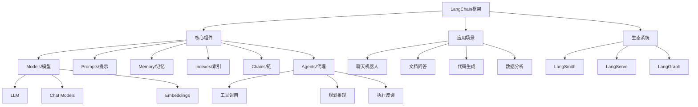

# LangChain 面试宝典

## 目录

- [基础问题](./01-基础问题.md)
- [进阶问题](./02-进阶问题.md)
- [实战问题](./03-实战问题.md)

## 概述

LangChain是一个强大的框架，用于开发由大型语言模型（LLM）驱动的应用程序。它提供了一套工具和抽象，使得开发者能够轻松构建基于LLM的应用，包括聊天机器人、文档问答系统、智能代理等。LangChain的核心价值在于将LLM与外部数据源、工具和计算能力相结合，实现更智能、更实用的AI应用。

## 知识图谱

## 学习建议

### 初学者
1. 从基础问题开始，理解LangChain的核心概念
2. 动手实践简单的LLM调用和Prompt工程
3. 学习Chain的基本使用，构建简单的应用

### 进阶者
1. 深入学习Memory和RAG实现原理
2. 掌握Agent的设计模式和应用场景
3. 研究源码，理解内部工作机制

### 高级开发者
1. 学习LangSmith进行应用调试和评估
2. 使用LangServe部署生产级应用
3. 探索LangGraph构建复杂的有状态应用
4. 性能优化和成本控制实践