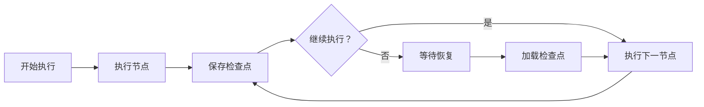
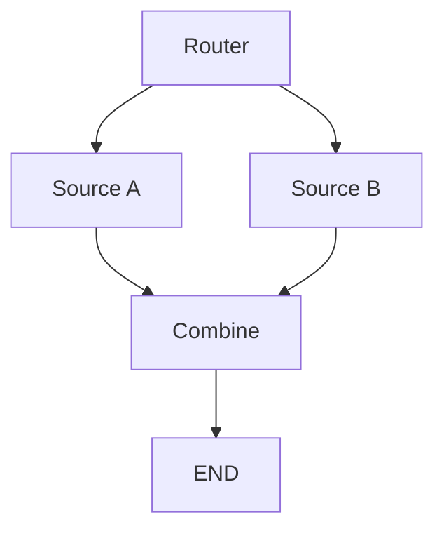

# LangGraph 进阶问题

## Q1: LangGraph 的 Checkpointer 机制是如何工作的？

**问题**：请详细解释 LangGraph 中 Checkpointer 的工作原理和使用方法。

**答案**：

Checkpointer（检查点）是 LangGraph 实现状态持久化的核心机制，它允许在图执行过程中保存和恢复状态，支持长时间运行的任务和人机交互。

**工作原理**：



**基本使用**：

```python
from langgraph.checkpoint.memory import MemorySaver
from langgraph.graph import StateGraph, END

# 创建检查点保存器
memory = MemorySaver()

# 编译时传入 checkpointer
app = graph.compile(checkpointer=memory)

# 使用 thread_id 标识会话
config = {"configurable": {"thread_id": "session_1"}}

# 执行会保存检查点
result = app.invoke({"messages": ["Hello"]}, config)

# 从中断处恢复
result = app.invoke(None, config)
```

**检查点保存的内容**：

```python
# 每个检查点包含
{
    "thread_id": "session_1",      # 会话标识
    "checkpoint_ns": "",           # 命名空间
    "checkpoint_id": "uuid",       # 检查点 ID
    "channel_values": {            # 状态值
        "messages": [...],
        "count": 5
    },
    "channel_versions": {...},     # 版本信息
    "versions_seen": {...}         # 已见版本
}
```

**使用场景**：

```python
# 场景 1: Human-in-the-loop
def wait_for_approval(state):
    # 保存状态，等待人工审批
    return {"status": "pending"}

# 人工批准后继续
app.invoke({"approval": True}, config)

# 场景 2: 长时间任务
def long_running_task(state):
    # 每步保存进度
    return {"progress": state["progress"] + 1}

# 任务失败后可从检查点恢复

# 场景 3: 多轮对话
config = {"configurable": {"thread_id": user_id}}
response = app.invoke({"message": input}, config)
```

**自定义 Checkpointer**：

```python
from langgraph.checkpoint.base import BaseCheckpointSaver

class DatabaseCheckpoint(BaseCheckpointSaver):
    def put(self, config, checkpoint):
        # 保存到数据库
        db.save(checkpoint)
    
    def get(self, config):
        # 从数据库加载
        return db.load(config)

db_saver = DatabaseCheckpoint()
app = graph.compile(checkpointer=db_saver)
```

**要点总结**：
- Checkpointer 实现状态持久化
- 编译时传入 checkpointer 参数
- 使用 thread_id 标识会话
- 支持中断后恢复执行
- 可自定义保存方式（内存、数据库等）

---

## Q2: 如何实现 Human-in-the-loop（人机交互）模式？

**问题**：请解释在 LangGraph 中如何实现 Human-in-the-loop 交互模式。

**答案**：

Human-in-the-loop（HITL）允许在 AI 工作流中插入人工审批或交互环节，是 LangGraph 的重要特性。

**实现方式 1：使用 interrupt_before**：

```python
from langgraph.graph import StateGraph, END

# 定义需要中断的节点
graph.add_node("review", review_function)
graph.add_node("publish", publish_function)

graph.set_entry_point("review")
graph.add_edge("review", "publish")
graph.add_edge("publish", END)

# 在 publish 前中断
app = graph.compile(
    checkpointer=MemorySaver(),
    interrupt_before=["publish"]  # 在执行 publish 前中断
)

# 执行到 review 后中断
config = {"configurable": {"thread_id": "task_1"}}
result = app.invoke({"content": "draft"}, config)
# 此时中断在 publish 之前

# 人工审查后继续
approval = get_human_approval()  # 获取人工审批
result = app.invoke(
    {"approved": approval},  # 传入审批结果
    config
)
```

**实现方式 2：显式等待节点**：

```python
class State(TypedDict):
    content: str
    approved: bool
    feedback: str

def wait_for_human(state):
    # 等待人工输入
    if state.get("approved") is None:
        return {"status": "waiting"}
    return {"status": "received"}

def process_feedback(state):
    if state["approved"]:
        return {"result": "published"}
    else:
        return {"result": f"revised: {state['feedback']}"}

graph.add_node("draft", create_draft)
graph.add_node("wait", wait_for_human)
graph.add_node("process", process_feedback)

graph.set_entry_point("draft")
graph.add_edge("draft", "wait")
graph.add_edge("wait", "process")
graph.add_edge("process", END)
```

**完整 HITL 示例**：

```python
from typing import TypedDict, Literal

class State(TypedDict):
    draft: str
    review_status: Literal["pending", "approved", "rejected"]
    feedback: str
    final_content: str

def write_draft(state):
    draft = llm_generate(state["topic"])
    return {"draft": draft}

def human_review(state):
    # 这里等待外部输入
    if state.get("review_status") is None:
        return {"status": "awaiting_review"}
    return state

def finalize(state):
    if state["review_status"] == "approved":
        return {"final_content": state["draft"]}
    else:
        return {"final_content": f"Revised: {state['feedback']}"}

graph = StateGraph(State)
graph.add_node("draft", write_draft)
graph.add_node("review", human_review)
graph.add_node("finalize", finalize)

graph.set_entry_point("draft")
graph.add_edge("draft", "review")
graph.add_edge("review", "finalize")
graph.add_edge("finalize", END)

app = graph.compile(
    checkpointer=MemorySaver(),
    interrupt_before=["review"]
)

# 使用流程
config = {"configurable": {"thread_id": "article_1"}}

# 步骤 1: 生成草稿
app.invoke({"topic": "AI Safety"}, config)

# 步骤 2: 人工审查（外部系统）
# 用户查看 draft 并提供 feedback

# 步骤 3: 继续执行
app.invoke({
    "review_status": "approved",
    "feedback": "Looks good!"
}, config)
```

**获取待处理任务**：

```python
# 查看当前状态
state = app.get_state(config)
print(state.values)  # 查看当前状态

# 查看所有检查点
history = app.get_state_history(config)
for checkpoint in history:
    print(checkpoint)
```

**要点总结**：
- 使用 interrupt_before 在特定节点前中断
- 需要配合 Checkpointer 使用
- 中断后通过 invoke 继续执行
- 适用于审批、审查、确认等场景
- 可获取状态历史进行审计

---

## Q3: LangGraph 中的状态归约器（Reducer）有哪些类型？

**问题**：请详细解释 LangGraph 中状态归约器的类型和使用场景。

**答案**：

状态归约器（Reducer）定义了新值如何与现有状态合并，是控制状态更新行为的关键机制。

**默认归约器（覆盖）**：

```python
class State(TypedDict):
    count: int  # 新值直接覆盖旧值
    name: str   # 新值直接覆盖旧值

def node(state: State) -> State:
    return {"count": 10}  # 覆盖原有值
```

**列表追加归约器**：

```python
from typing import Annotated, List
from operator import add

class State(TypedDict):
    # 新列表元素追加到现有列表
    messages: Annotated[List[str], add]
    history: Annotated[List[dict], add]

def node(state: State) -> State:
    return {
        "messages": ["new message"]  # 追加而不是覆盖
    }
```

**自定义归约器**：

```python
from typing import Annotated

def max_reducer(current: int, new: int) -> int:
    return max(current, new)

def sum_reducer(current: int, new: int) -> int:
    return current + new

class State(TypedDict):
    max_score: Annotated[int, max_reducer]
    total: Annotated[int, sum_reducer]

def update_node(state: State) -> State:
    return {
        "max_score": 80,  # 与当前最大值比较
        "total": 10       # 累加到总和
    }
```

**字典合并归约器**：

```python
from typing import Annotated, Dict

def dict_merge(current: Dict, update: Dict) -> Dict:
    return {**current, **update}

class State(TypedDict):
    metadata: Annotated[Dict, dict_merge]

def node(state: State) -> State:
    return {
        "metadata": {"user_id": "123"}  # 合并到现有字典
    }
```

**消息列表专用归约器**：

```python
from langgraph.graph.message import add_messages
from typing import Annotated, List
from langchain.schema import BaseMessage

class State(TypedDict):
    # 专门用于消息列表，处理去重和排序
    messages: Annotated[List[BaseMessage], add_messages]

def agent(state: State) -> State:
    response = llm.invoke(state["messages"])
    return {"messages": [response]}  # 智能追加
```

**归约器优先级**：

```python
# 节点返回的值按以下顺序处理
# 1. 如果有 Annotated 归约器，使用归约器
# 2. 否则使用默认覆盖行为

class State(TypedDict):
    # 使用归约器
    items: Annotated[List, add]
    # 默认覆盖
    status: str

def node(state: State) -> State:
    return {
        "items": [1, 2],    # 追加
        "status": "done"    # 覆盖
    }
```

**实际应用场景**：

```python
# 场景 1: 累积对话历史
class ChatState(TypedDict):
    messages: Annotated[List, add]

# 场景 2: 追踪最大迭代次数
class LoopState(TypedDict):
    max_iterations: Annotated[int, max_reducer]

# 场景 3: 收集多个工具结果
class ToolState(TypedDict):
    results: Annotated[List, add]
    errors: Annotated[List, add]

# 场景 4: 更新元数据
class WorkflowState(TypedDict):
    metadata: Annotated[Dict, dict_merge]
```

**要点总结**：
- 默认行为是新值覆盖旧值
- 使用 Annotated 指定归约器
- 常用归约器：add（追加）、max、自定义函数
- 消息列表使用 add_messages 专用归约器
- 归约器决定状态合并逻辑

---

## Q4: 如何在 LangGraph 中实现并行执行？

**问题**：请解释 LangGraph 中实现并行执行的方法和原理。

**答案**：

LangGraph 支持通过条件边返回多个目标节点来实现并行执行。

**基本条件并行**：

```python
from typing import List

def parallel_router(state) -> List[str]:
    # 返回多个节点名称实现并行
    return ["node_a", "node_b", "node_c"]

graph.add_conditional_edges(
    "router",
    parallel_router,
    {
        "node_a": "node_a",
        "node_b": "node_b",
        "node_c": "node_c"
    }
)
```

**完整并行示例**：

```python
from typing import TypedDict, List, Annotated
from operator import add

class State(TypedDict):
    query: str
    results_a: List[str]
    results_b: List[str]
    combined: Annotated[List, add]

def fetch_from_source_a(state) -> State:
    results = search_source_a(state["query"])
    return {"results_a": results}

def fetch_from_source_b(state) -> State:
    results = search_source_b(state["query"])
    return {"results_b": results}

def combine_results(state) -> State:
    all_results = state["results_a"] + state["results_b"]
    return {"combined": all_results}

def should_parallel(state) -> List[str]:
    # 返回多个节点实现并行
    return ["source_a", "source_b"]

graph = StateGraph(State)
graph.add_node("source_a", fetch_from_source_a)
graph.add_node("source_b", fetch_from_source_b)
graph.add_node("combine", combine_results)

graph.set_entry_point("router")
graph.add_node("router", lambda s: s)
graph.add_conditional_edges(
    "router",
    should_parallel,
    {
        "source_a": "source_a",
        "source_b": "source_b"
    }
)
graph.add_edge("source_a", "combine")
graph.add_edge("source_b", "combine")
graph.add_edge("combine", END)

app = graph.compile()
```

**并行执行原理**：



**使用场景**：

```python
# 场景 1: 多路搜索
def search_parallel(state):
    return ["search_google", "search_wikipedia", "search_database"]

# 场景 2: 多模型评估
def evaluate_with_models(state):
    return ["gpt4_eval", "claude_eval", "llama_eval"]

# 场景 3: 并行工具调用
def call_tools(state):
    tools_to_call = identify_tools(state["request"])
    return [f"tool_{t}" for t in tools_to_call]
```

**等待并行完成**：

```python
# 所有并行节点完成后才会执行下一节点
graph.add_edge("parallel_node_1", " aggregator")
graph.add_edge("parallel_node_2", "aggregator")
graph.add_edge("parallel_node_3", "aggregator")
# aggregator 会等待所有输入
```

**并行 + 条件**：

```python
def dynamic_parallel(state) -> List[str]:
    nodes = []
    if state["need_search"]:
        nodes.append("search")
    if state["need_calculation"]:
        nodes.append("calculate")
    if state["need_analysis"]:
        nodes.append("analyze")
    return nodes  # 动态决定并行节点
```

**注意事项**：

```python
# 1. 并行节点应相互独立
def node_a(state):
    # 不依赖其他并行节点的输出
    return {"data_a": fetch_a()}

# 2. 使用合适的归约器收集结果
class State(TypedDict):
    results: Annotated[List, add]  # 追加所有结果

# 3. 避免并行节点间的状态竞争
# 每个并行节点修改不同的状态字段
```

**要点总结**：
- 条件边返回多个节点实现并行
- 并行节点应相互独立
- 使用归约器收集并行结果
- 汇聚节点等待所有并行完成
- 支持动态决定并行节点

---

## Q5: LangGraph 中的子图（Subgraph）如何使用？

**问题**：请解释 LangGraph 中子图的概念、使用方法和嵌套原理。

**答案**：

子图允许将复杂的图结构分解为可复用的模块，支持层次化的工作流设计。

**创建子图**：

```python
from langgraph.graph import StateGraph, END

# 定义子图的状态
class SubState(TypedDict):
    sub_query: str
    sub_result: str

# 创建子图
def create_subgraph():
    subgraph = StateGraph(SubState)
    
    subgraph.add_node("process", process_function)
    subgraph.add_node("validate", validate_function)
    
    subgraph.set_entry_point("process")
    subgraph.add_edge("process", "validate")
    subgraph.add_edge("validate", END)
    
    return subgraph.compile()

subgraph = create_subgraph()
```

**在主图中使用子图**：

```python
class MainState(TypedDict):
    query: str
    result: str

main_graph = StateGraph(MainState)

# 添加子图节点
main_graph.add_node("subgraph", subgraph)
main_graph.set_entry_point("subgraph")
main_graph.add_edge("subgraph", END)

app = main_graph.compile()
```

**状态传递**：

```python
# 方式 1: 状态自动传递（字段匹配）
class ParentState(TypedDict):
    query: str
    result: str

class ChildState(TypedDict):
    query: str  # 字段名匹配会自动传递
    intermediate: str

# 方式 2: 手动转换状态
def prepare_subgraph_input(state: ParentState) -> ChildState:
    return {
        "query": f"Processing: {state['query']}"
    }

def process_subgraph_output(sub_result: ChildState) -> ParentState:
    return {
        "result": sub_result["intermediate"]
    }
```

**嵌套子图**：

```python
# 多层嵌套
level3 = create_deep_subgraph()
level2 = create_mid_subgraph(level3)  # level3 作为 level2 的子图
level1 = create_top_subgraph(level2)   # level2 作为 level1 的子图

app = level1.compile()
```

**实际应用场景**：

```python
# 场景 1: 可复用的工具调用子图
def create_tool_calling_subgraph():
    graph = StateGraph(ToolState)
    graph.add_node("select_tool", select_tool)
    graph.add_node("execute_tool", execute_tool)
    graph.add_node("parse_result", parse_result)
    # ... 复杂逻辑
    return graph.compile()

# 在主图中复用
main_graph.add_node("tools", tool_subgraph)
main_graph.add_node("tools", tool_subgraph)  # 多处使用

# 场景 2: RAG 子图
def create_rag_subgraph():
    graph = StateGraph(RAGState)
    graph.add_node("retrieve", retrieve_documents)
    graph.add_node("rerank", rerank_documents)
    graph.add_node("generate", generate_answer)
    return graph.compile()

# 场景 3: Agent 团队
def create_agent_team():
    graph = StateGraph(TeamState)
    graph.add_node("researcher", researcher_agent)
    graph.add_node("writer", writer_agent)
    graph.add_node("reviewer", reviewer_agent)
    # 内部循环协作
    return graph.compile()
```

**子图与 Checkpointer**：

```python
# 子图有独立的检查点命名空间
config = {
    "configurable": {
        "thread_id": "main_thread",
        "checkpoint_ns": "subgraph_name"  # 子图命名空间
    }
}
```

**调试子图**：

```python
# 查看子图状态
state = app.get_state(config)
print(state)

# 查看子图历史
history = app.get_state_history(config)
```

**要点总结**：
- 子图实现工作流模块化
- 字段匹配自动传递状态
- 支持多层嵌套
- 子图有独立命名空间
- 适合构建可复用组件

---

## Q6: LangGraph 的错误处理机制是什么？

**问题**：请解释 LangGraph 中如何处理错误和异常。

**答案**：

LangGraph 提供多种错误处理机制，确保工作流的健壮性。

**方式 1: 节点内异常处理**：

```python
def robust_node(state: State) -> State:
    try:
        result = risky_operation(state["data"])
        return {"result": result, "error": None}
    except Exception as e:
        return {
            "result": None,
            "error": str(e),
            "retry_count": state.get("retry_count", 0) + 1
        }
```

**方式 2: 错误处理节点**：

```python
def error_handler(state: State) -> State:
    error = state.get("error")
    # 记录错误
    log_error(error)
    # 尝试恢复
    return {"status": "recovered", "fallback": True}

graph.add_node("main", main_processing)
graph.add_node("error_handler", error_handler)

def route_or_error(state):
    if state.get("error"):
        return "error_handler"
    return "continue"

graph.add_conditional_edges(
    "main",
    route_or_error,
    {
        "error_handler": "error_handler",
        "continue": "next_step"
    }
)
```

**方式 3: 重试机制**：

```python
class State(TypedDict):
    attempt: int
    max_attempts: int
    data: str

def retryable_node(state: State) -> State:
    try:
        result = flaky_operation(state["data"])
        return {"result": result, "attempt": 0}
    except Exception as e:
        if state["attempt"] >= state["max_attempts"]:
            raise  # 超过最大重试次数，抛出异常
        return {
            "error": str(e),
            "attempt": state["attempt"] + 1
        }

def should_retry(state: State) -> str:
    if state.get("error") and state["attempt"] < state["max_attempts"]:
        return "retry"
    return "continue"

graph.add_node("process", retryable_node)

graph.add_conditional_edges(
    "process",
    should_retry,
    {
        "retry": "process",  # 循环重试
        "continue": "next"
    }
)
```

**方式 4: 超时处理**：

```python
import asyncio

async def node_with_timeout(state: State) -> State:
    try:
        result = await asyncio.wait_for(
            slow_operation(state["data"]),
            timeout=30.0  # 30 秒超时
        )
        return {"result": result}
    except asyncio.TimeoutError:
        return {"error": "timeout", "fallback": True}
```

**方式 5: 降级策略**：

```python
def graceful_degradation(state: State) -> State:
    if state.get("primary_failed"):
        # 使用备用方案
        result = fallback_operation(state["data"])
        return {"result": result, "using_fallback": True}
    return state

graph.add_node("primary", primary_operation)
graph.add_node("fallback", graceful_degradation)

def check_success(state):
    if state.get("result"):
        return "success"
    return "fallback"

graph.add_conditional_edges(
    "primary",
    check_success,
    {
        "success": END,
        "fallback": "fallback"
    }
)
```

**全局异常处理**：

```python
# 在应用层捕获异常
try:
    result = app.invoke(input_data, config)
except Exception as e:
    # 全局错误处理
    logger.error(f"Workflow failed: {e}")
    result = handle_global_error(e)
```

**错误恢复**：

```python
# 使用 Checkpointer 从错误中恢复
config = {"configurable": {"thread_id": "failed_run"}}

# 查看错误状态
state = app.get_state(config)
print(state.values.get("error"))

# 修正后继续
corrected_input = fix_input(state.values)
result = app.invoke(corrected_input, config)
```

**最佳实践**：

```python
class State(TypedDict):
    errors: Annotated[List[str], add]  # 累积错误
    retry_count: int
    status: str

def best_practice_node(state: State) -> State:
    errors = []
    try:
        # 主要逻辑
        result = process(state["data"])
        return {"result": result, "status": "success"}
    except SpecificError as e:
        errors.append(f"Specific: {e}")
    except Exception as e:
        errors.append(f"General: {e}")
    
    return {
        "errors": errors,
        "status": "failed",
        "retry_count": state["retry_count"] + 1
    }
```

**要点总结**：
- 节点内使用 try-except 捕获异常
- 设计专门的错误处理节点
- 实现重试和降级机制
- 使用 Checkpointer 支持错误恢复
- 累积错误信息便于调试

---

## Q7: LangGraph 如何实现流式输出（Streaming）？

**问题**：请解释 LangGraph 中流式输出的实现方式和使用场景。

**答案**：

LangGraph 支持多种流式输出模式，适用于实时反馈和长任务场景。

**基础流式输出**：

```python
# 流式获取状态更新
for state in app.stream({"messages": ["Hello"]}):
    print(state)
    # 每次迭代输出当前状态
```

**流式输出模式**：

```python
# 模式 1: 值流（默认）
for output in app.stream(input, config):
    # output 是每个节点的返回值
    print(output)

# 模式 2: 键值流
for output in app.stream(input, config, stream_mode="values"):
    # output 是累积状态值
    print(output)

# 模式 3: 调试流
for output in app.stream(input, config, stream_mode="debug"):
    # output 包含详细的执行信息
    print(f"Node: {output['node']}, Output: {output['output']}")

# 模式 4: 更新流
for output in app.stream(input, config, stream_mode="updates"):
    # output 仅包含状态更新
    print(output)
```

**LLM 流式输出**：

```python
def streaming_agent(state: State) -> State:
    # 使用 LangChain 的流式 LLM
    full_response = ""
    for chunk in llm.stream(state["messages"]):
        full_response += chunk.content
        # 可以实时发送给用户
        yield {"partial_response": chunk.content}
    
    return {"messages": [full_response]}
```

**自定义流式处理器**：

```python
class StreamingState(TypedDict):
    tokens: Annotated[List[str], add]
    complete: bool

async def stream_processor(state: StreamingState):
    async for token in generate_tokens(state["prompt"]):
        yield {"tokens": [token]}  # 实时输出 token
    return {"complete": True}

graph.add_node("generate", stream_processor)
app = graph.compile()

# 使用
async for update in app.astream({"prompt": "Write a story"}):
    print(update)
```

**多模式流式**：

```python
# 同时获取多种流模式
for output in app.stream(
    input,
    config,
    stream_mode=["values", "updates"]
):
    mode, data = output
    if mode == "values":
        print(f"Current state: {data}")
    else:
        print(f"Update: {data}")
```

**实际应用场景**：

```python
# 场景 1: 实时聊天
def chat_agent(state):
    response = ""
    for chunk in llm.stream(state["messages"]):
        response += chunk
        yield {"partial": chunk}  # 实时显示
    return {"messages": [response]}

# 场景 2: 进度报告
def long_task(state):
    for i, step in enumerate(steps):
        result = process(step)
        yield {
            "progress": f"Step {i+1}/{len(steps)}",
            "results": [result]
        }
    return {"complete": True}

# 场景 3: 多节点协作流
def team_collaboration(state):
    # 每个专家输出部分结果
    for expert in experts:
        partial = expert.process(state)
        yield {"contributions": [partial]}
```

**结合 WebSocket 推送**：

```python
# 在实际应用中推送到前端
@app.websocket("/ws")
async def websocket_endpoint(websocket):
    await websocket.accept()
    
    async for update in app.astream(input, config):
        # 实时推送到客户端
        await websocket.send_json(update)
```

**流式输出配置**：

```python
# 配置流式行为
app = graph.compile()

# 完整示例
async def run_with_streaming():
    async for event in app.astream(
        {"query": "What is AI?"},
        config,
        stream_mode="updates",
        subgraphs=True  # 包含子图输出
    ):
        namespace, update = event
        print(f"{namespace}: {update}")
```

**要点总结**：
- 使用 stream 或 astream 方法
- 支持多种流模式（values、updates、debug）
- 适用于实时反馈场景
- 可结合 WebSocket 推送
- 支持子图流式输出

---

## Q8: LangGraph 的性能优化策略有哪些？

**问题**：请介绍 LangGraph 应用的性能优化方法和最佳实践。

**答案**：

**1. 状态设计优化**：

```python
# 优化前：状态过大
class State(TypedDict):
    all_history: List[dict]  # 可能很大
    raw_data: bytes          # 不必要的数据
    temp_cache: dict         # 临时数据

# 优化后：精简状态
class State(TypedDict):
    messages: Annotated[List, add]  # 只保留必要消息
    result: str                     # 最终结果
    # 大对象使用外部存储
    data_reference: str  # 存储 ID 而不是数据本身
```

**2. 并行化优化**：

```python
# 串行执行
graph.add_edge("fetch_a", "fetch_b")
graph.add_edge("fetch_b", "fetch_c")
graph.add_edge("fetch_c", "process")

# 并行执行
def parallel_router(state):
    return ["fetch_a", "fetch_b", "fetch_c"]

graph.add_conditional_edges(
    "start",
    parallel_router,
    {"fetch_a": "fetch_a", "fetch_b": "fetch_b", "fetch_c": "fetch_c"}
)
# 三个 fetch 并行执行
```

**3. Checkpointer 优化**：

```python
# 使用高性能 Checkpointer
from langgraph.checkpoint.sqlite import SqliteSaver

# 内存 Checkpointer（开发）
memory = MemorySaver()

# SQLite Checkpointer（生产）
db = SqliteSaver(conn)

# 自定义异步 Checkpointer
class AsyncCheckpoint(BaseCheckpointSaver):
    async def aput(self, config, checkpoint):
        # 异步保存，不阻塞主流程
        await async_db.save(checkpoint)
```

**4. 节点粒度优化**：

```python
# 过细粒度：过多节点开销
graph.add_node("step_1", tiny_task_1)
graph.add_node("step_2", tiny_task_2)
graph.add_node("step_3", tiny_task_3)

# 合理粒度：合并小任务
graph.add_node("process", combined_task)

def combined_task(state):
    result_1 = tiny_task_1(state)
    result_2 = tiny_task_2(result_1)
    result_3 = tiny_task_3(result_2)
    return result_3
```

**5. 缓存优化**：

```python
from functools import lru_cache
import hashlib

@lru_cache(maxsize=1000)
def cached_llm_call(prompt_hash: str) -> str:
    # 缓存 LLM 响应
    return llm_cache[prompt_hash]

def smart_node(state):
    # 生成 prompt 哈希
    prompt_hash = hashlib.md5(
        state["prompt"].encode()
    ).hexdigest()
    
    # 检查缓存
    if cached := get_cached(prompt_hash):
        return {"response": cached}
    
    # 调用 LLM
    response = llm.invoke(state["prompt"])
    save_cache(prompt_hash, response)
    return {"response": response}
```

**6. 超时和限流**：

```python
import asyncio
from asyncio import Semaphore

# 限流
semaphore = Semaphore(5)  # 最多 5 个并发

async def rate_limited_node(state):
    async with semaphore:
        return await call_llm(state)

# 超时
async def timeout_node(state):
    try:
        return await asyncio.wait_for(
            slow_operation(state),
            timeout=30.0
        )
    except asyncio.TimeoutError:
        return {"error": "timeout"}
```

**7. 资源清理**：

```python
def resource_aware_node(state):
    try:
        # 使用资源
        connection = get_db_connection()
        result = process(connection, state)
        return {"result": result}
    finally:
        # 确保资源释放
        connection.close()
```

**8. 监控和调优**：

```python
import time

def monitored_node(state):
    start = time.time()
    try:
        result = process(state)
        return {"result": result}
    finally:
        duration = time.time() - start
        metrics.record("node_duration", duration)

# 使用 LangSmith 追踪
from langsmith import traceable

@traceable
def traced_node(state):
    return process(state)
```

**性能基准测试**：

```python
import time

# 基准测试
start = time.time()
results = app.invoke(test_input)
duration = time.time() - start
print(f"Execution time: {duration}s")

# 压力测试
for i in range(100):
    app.invoke(test_input)
```

**要点总结**：
- 精简状态设计，避免大数据
- 使用并行化提高吞吐量
- 选择合适的 Checkpointer
- 合理设置节点粒度
- 实现缓存减少重复计算
- 添加超时和限流保护
- 使用监控工具分析瓶颈

---
