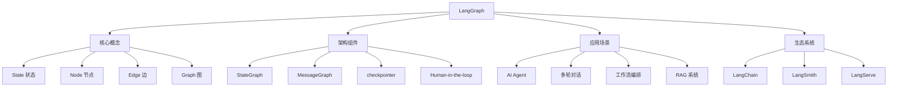

# LangGraph 面试宝典

## 目录

- [基础问题](./01-基础问题.md)
- [进阶问题](./02-进阶问题.md)
- [实战问题](./03-实战问题.md)

## 概述

LangGraph 是 LangChain 团队推出的基于图结构的 AI 应用开发框架，用于构建有状态、多参与者的 LLM 应用。它将工作流建模为图结构，节点表示计算步骤，边表示控制流，支持循环、条件分支等复杂模式，特别适合构建 Agent、多轮对话系统等需要维护状态的应用。

## 知识图谱

## 学习建议

### 初学者路径
1. 理解图结构基本概念（节点、边、状态）
2. 掌握 StateGraph 的创建和编译
3. 学习基础的状态管理和消息传递

### 进阶学习
1. 深入理解 checkpointer 机制和持久化
2. 掌握 Human-in-the-loop 交互模式
3. 学习复杂条件路由和并行执行

### 实战提升
1. 构建完整的 AI Agent 系统
2. 实现生产级别的状态管理
3. 性能优化和错误处理

## 面试准备建议

- **初级岗位**：重点掌握基础问题，理解核心概念
- **中级岗位**：熟练掌握进阶问题，能设计合理的工作流
- **高级岗位**：深入实战问题，具备架构设计和性能优化能力
